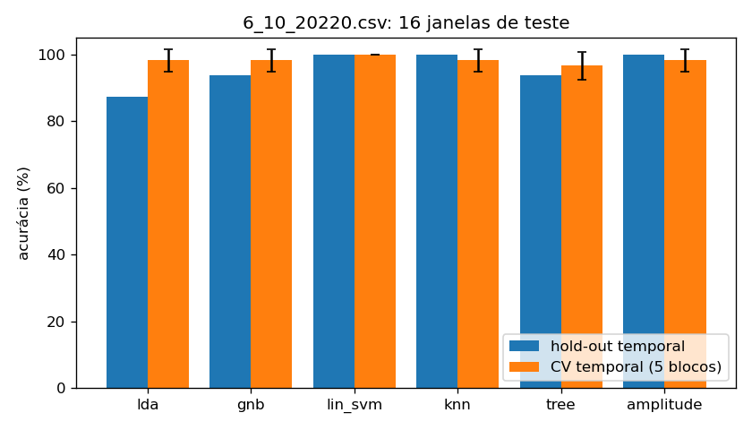
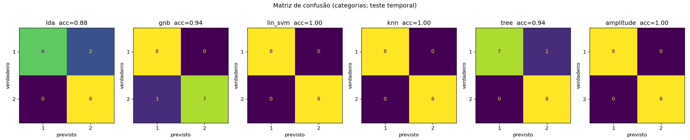
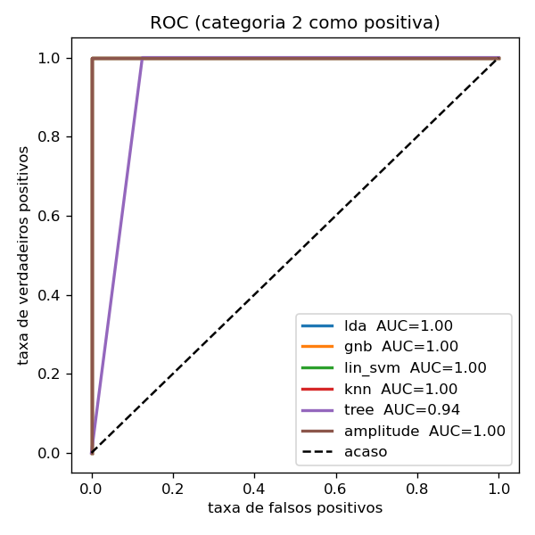
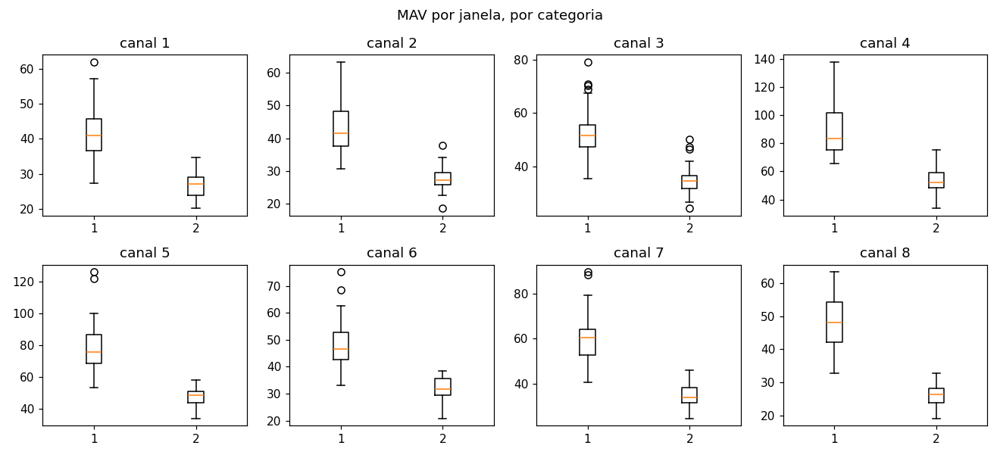
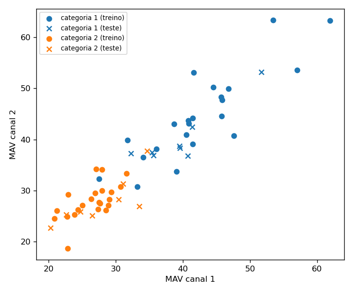
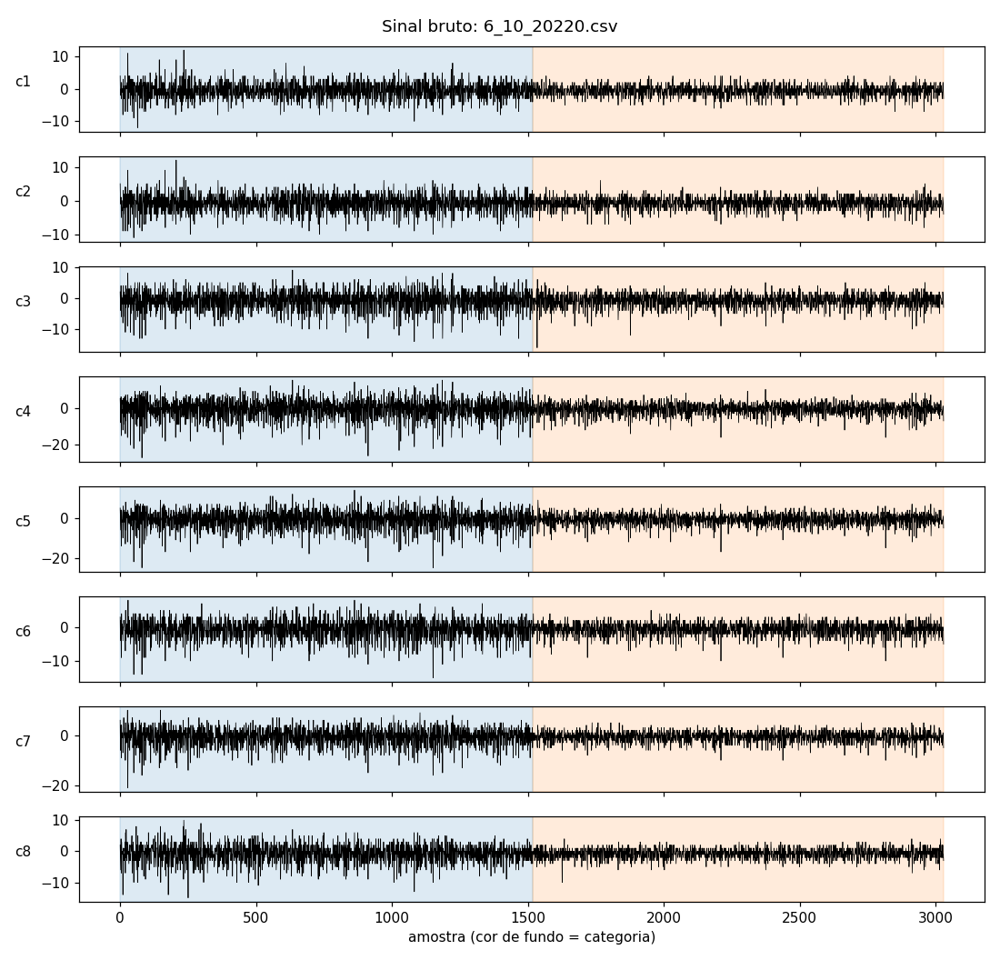
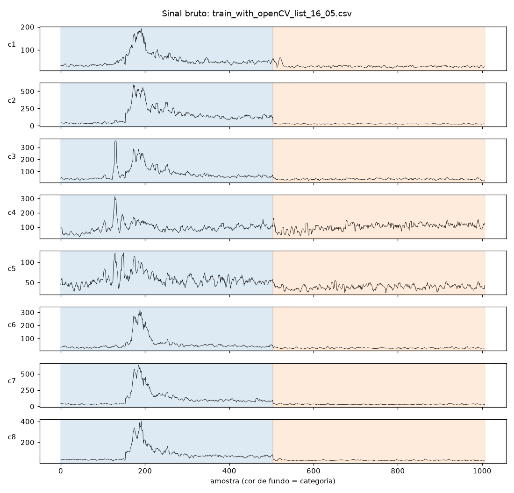

# Análise dos resultados do mestrado

O que os dados do mestrado permitem concluir sobre os classificadores, e o que
não permitem. Todas as figuras e números saem do comando `analyze_legacy`
(opção 5 do `scripts/menu.sh`), com semente 42; o teste
`tests/test_analysis.py::test_documented_numbers_of_the_thesis_file` confere os
números citados aqui. Rodado em 2026-09-26, scikit-learn 1.7.2 (imagem Docker)
e 1.9.1 (host), com os mesmos resultados.

```bash
docker compose -f docker/compose.yaml run --rm train \
  ros2 run mestrado_emg analyze_legacy /data/6_10_20220.csv --out /models/analise
```

## Resumo

1. **Os cinco classificadores acertam de 88 % a 100 %, mas uma regra de um
   número só faz o mesmo.** A média do MAV dos 8 canais, com um limiar
   (LDA de uma variável, chamada aqui de `amplitude`), acerta 100 % no
   hold-out e 98 % na validação cruzada. O que separa as duas categorias é o
   **nível geral de ativação**, não um padrão entre músculos.
2. **Categoria e momento da gravação não se separam.** Cada categoria é um
   único bloco contínuo de ~8,5 s, gravado um depois do outro. Com esses dados
   não dá para dizer se o classificador reconhece a postura do cotovelo, o
   esforço, ou simplesmente "primeira metade × segunda metade" da gravação.
3. **A validação honesta confirma os números, mas eles valem pouco.** A
   validação cruzada temporal (blocos, com purga) dá 97–100 %, quase igual à
   embaralhada. São 60 janelas de um sujeito numa sessão: cada erro no teste
   vale 6 pontos percentuais.
4. **Os arquivos `train_with_openCV_list_16_05*.csv` não servem para comparar.**
   Foram gravados no modo de 50 Hz do Myo (envoltória retificada, ~40
   amostras/s) e processados como se fossem de 200 Hz.

## O arquivo do mestrado: `6_10_20220.csv`

Um sujeito, uma sessão, 2 categorias (1 = cotovelo a ~170°, 2 = a ~90°,
segundo a ferramenta de captura), 3030 amostras em 17,1 s (~177 amostras/s:
os 200 Hz do Myo com alguma perda de pacotes). São 30 janelas de 250 ms por
categoria.

### Acurácia

| Classificador | Hold-out temporal (16 janelas) | CV temporal, 5 blocos | CV embaralhada, 5 partições | AUC |
|---|---|---|---|---|
| LDA | 0,88 | 0,98 ± 0,03 | 0,97 ± 0,04 | 1,00 |
| GNB | 0,94 | 0,98 ± 0,03 | 0,98 ± 0,03 | 1,00 |
| "lin_svm" (RBF) | 1,00 | 1,00 ± 0,00 | 0,98 ± 0,03 | 1,00 |
| kNN | 1,00 | 0,98 ± 0,03 | 0,98 ± 0,03 | 1,00 |
| Árvore | 0,94 | 0,97 ± 0,04 | 0,95 ± 0,07 | 0,94 |
| **amplitude** (1 número) | **1,00** | **0,98 ± 0,03** | **0,98 ± 0,03** | **1,00** |

Com RMS e o split `legacy` do mestrado, os cinco dão 0,9444, exatamente os
scores históricos; a `amplitude` também dá 0,94.



### Matrizes de confusão e ROC

Os erros são poucos: o LDA e a árvore tomam janelas da categoria 1 pela 2, e
o GNB, uma da 2 pela 1. O LDA erra as **duas últimas janelas da categoria 1** (logo antes da
troca), mas tem AUC 1,00: a ordem dos escores está perfeita e só o limiar de
decisão ficou deslocado. Com 42 janelas de treino e 8 features quase
colineares, os coeficientes do LDA são instáveis.





A ROC agora usa o escore contínuo de cada classificador
(`decision_function`/`predict_proba`). A tela do mestrado passava a previsão
0/1 para o `roc_curve`, o que dá um único ponto e não uma curva.

### Por que um número basta

A categoria 1 tem um MAV maior que a categoria 2 em **todos** os 8 canais, em
média 1,6 vez maior. Os canais andam juntos: correlação média de 0,84 entre eles, e o
primeiro componente principal responde por 86 % da variância das features
(padronizadas com a estatística do treino). Na prática, os 8 canais são uma
medida só, repetida.





No sinal bruto, a diferença de amplitude entre os dois blocos é visível a olho.
Dentro de cada categoria não há tendência significativa ao longo do tempo
(Spearman −0,19 e −0,29; p = 0,33 e 0,12).



### O que isso quer dizer

- **Categoria = bloco de tempo.** O arquivo tem exatamente dois trechos: 1518
  amostras da categoria 1 e depois 1512 da 2. Qualquer coisa que mude entre o
  começo e o fim da gravação (acomodação dos eletrodos, cansaço, postura do
  resto do corpo) fica confundida com a categoria. A validação temporal
  *dentro* de cada categoria não resolve isso; só resolveria gravar as
  categorias alternadas, em vários blocos.
- **Não se sabe qual postura exigia mais ativação.** O arquivo não diz como o
  braço estava apoiado em cada postura. Por isso não dá para interpretar
  fisiologicamente por que a categoria de ~170° tem mais amplitude.
- **Temporal ≈ embaralhada, aqui.** As duas validações diferem em até 2
  pontos. O problema de misturar janelas vizinhas (achado 8 do inventário)
  pesa mais quando as classes são parecidas; aqui elas são separáveis por
  amplitude, então a diferença quase não aparece.
- **Escala arbitrária, sem efeito.** Os filtros do mestrado foram guardados
  sem o ganho: o passa-altas amplifica 15,5 vezes e o rejeita-faixa 1,5 vez,
  cerca de 23 vezes no total. Por isso o MAV (20 a 140) é maior que o próprio
  sinal bruto (±20). Os cinco classificadores não mudam com uma escala
  uniforme, então isso não altera nenhum resultado.

## Os arquivos de 50 Hz: `train_with_openCV_list_16_05.csv` e `..._16_051.csv`

Eram o arquivo padrão da tela de treino do mestrado. Os valores são todos
positivos (17 a 637) e chegam a ~40 amostras/s: é a **envoltória retificada**
do modo de 50 Hz do Myo, não o sinal bruto de 200 Hz. O pipeline do mestrado
os tratava como 200 Hz: os filtros não correspondem a esse sinal, e cada
"janela de 250 ms" de 50 amostras dura, na verdade, ~1,25 s. O
`analyze_legacy` agora mede a taxa pela coluna `time` e avisa.



Além disso:

- **São só 10 janelas por categoria** e 4 no teste. A validação cruzada varia
  muito (a árvore dá 0,60 ± 0,41 no `16_05`).
- **A categoria 1 contém um movimento, não uma postura.** Há um pico grande
  de ativação no meio do bloco, em quase todos os canais.
- **No `16_051`, as 8 primeiras amostras são da categoria 2**, antes do bloco
  da categoria 1.

Os números desses arquivos estão no `resumo.md` de cada análise, mas **não
devem ser usados como resultado**.

## Implicações para as próximas coletas

Sem escolher hardware (a decisão é do Caio), o que estes dados mostram que
faltou:

1. **Alternar as categorias em vários blocos**, em ordem variada, para que
   categoria e tempo deixem de coincidir.
2. **Mais sessões e mais sujeitos.** Com um sujeito, nada se diz sobre
   generalização. Entre sujeitos, a avaliação é deixando um sujeito de fora.
3. **Gravar na taxa nativa do sensor**, com a taxa registrada no arquivo, e
   conferir antes de treinar (o `analyze_legacy` já confere).
4. **Sempre rodar a referência `amplitude`.** Um classificador só mostra que
   aprendeu algo além do nível geral de ativação quando supera essa referência.
5. **Gravar o ângulo contínuo** (`CONTINUOUS=true` na captura). É o dado de
   que a regressão contínua do `semg-digital-twins` precisa, e dispensa
   categorias.
